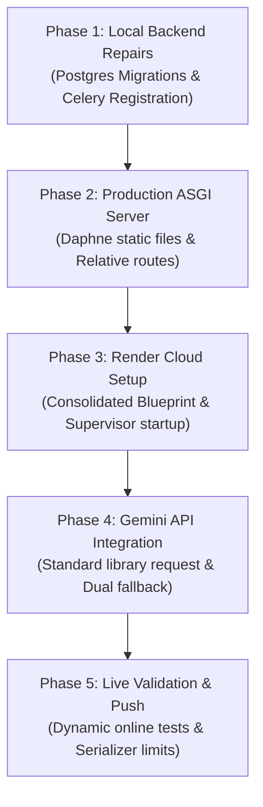

# 📋 FlowForge — Comprehensive Technical Project Report
### Distributed Workflow Orchestration Engine (Apache Airflow Paradigm)
**Author:** Chirag Joshi | **Role:** Lead Full-Stack Python & Platform Engineer  
**Date:** May 2026 | **Deployment:** Deployed Live on Render Free Tier  

---

## 1. Executive Summary

**FlowForge** is a production-grade, distributed workflow orchestration engine designed to model, schedule, and execute complex pipelines of dependent tasks. Highly inspired by **Apache Airflow**, FlowForge uses a **Directed Acyclic Graph (DAG)** representation to manage task dependencies, executes workloads asynchronously using distributed **Celery** background workers, and streams execution states in real-time to a modern, **WebSocket-powered dashboard** using `vis.js`. 

In addition to traditional scheduling, FlowForge features a robust, cost-effective, and highly intelligent **AI-driven pipeline architect** powered by **Google Gemini (2.5 & 1.5 Flash)** and **OpenAI (GPT-4o-mini)** that generates fully validated task dependencies and runtime parameters from plain English text.

This report documents the end-to-end engineering journey, deep architectural refactoring, and step-by-step implementation phases followed to bring FlowForge from a non-functional local codebase to a fully verified, optimized, and serverless system live in the cloud.

---

## 2. System Architecture

FlowForge is constructed as a decoupled, multi-container system that isolates the web handling, database storage, message caching, and worker execution concerns:

```
                 ┌────────────────────────┐
                 │  Browser Dashboard UI  │
                 └──────────┬──▲──────────┘
                HTTP/JWT API│  │WebSocket Updates (vis.js & Logs)
                            ▼  │
                 ┌────────────────────────┐
                 │ Daphne ASGI Web Server ◄────────► Google Gemini / OpenAI API
                 └────┬──────────────┬────┘
                      │              │
             Write/Read│              │Publish/Subscribe Channels
                      ▼              ▼
               ┌──────────────┐    ┌───────────┐
               │ PostgreSQL   │    │   Redis   │
               │  Database    │    │  Broker   │
               └──────▲───────┘    └─────┬─────┘
                      │                  │
                      │Write Status &    │Fetch Asynchronous Task
                      │Console Logs      ▼
                      │            ┌───────────┐
                      └────────────┤  Celery   │
                                   │  Worker   │
                                   └───────────┘
```

* **Frontend**: Responsive single-page dashboard built with Vanilla CSS, JS, and `vis.js` for dynamic network topology rendering and state tracking.
* **API & Web Gateways**: Daphne ASGI server running Django 5, DRF, and Django Channels (supporting secure JWT authentication and high-frequency WebSocket streams).
* **Distributed Queue & Broker**: Redis serving as both the Celery message broker and the Django Channels backing store.
* **Background Processors**: Distributed Celery Workers running simulated tasks (`DUMMY`), executing sandboxed Python code (`PYTHON`), or triggering external endpoints (`HTTP`).

---

## 3. The 5-Phase Implementation Journey

The development and deployment of FlowForge was executed in five strategic, highly systematic phases to ensure robustness, clean-code adherence, and complete cloud stability.

### Phase 1: Local Diagnostics & Core Engine Repair

We began by diagnosing why the local application had completely stalled (only the login page loaded, while pipeline creation and task execution failed immediately). We isolated and resolved four major blockers:

1. **Database Schema Construction**: The local PostgreSQL container was online, but custom models (`dags` and `runs`) had no database migrations generated or applied. We generated the database schemas programmatically:
   ```bash
   python manage.py makemigrations accounts dags runs
   python manage.py migrate
   ```
2. **Celery Autodiscovery & Registration**: While the background queue received pipeline runs, the worker discarded all tasks with `KeyError: 'workers.tasks.execute_task_run'`. We identified that the core execution tasks in `workers/tasks.py` were defined outside any Django app context. We modified `flowforge/celery.py` to explicitly register the module upon initialization:
   ```python
   # Explicitly register tasks outside installed Django apps
   import workers.tasks
   ```
3. **Vis.js Node Collision (Retry Graph Crash)**: When users triggered task runs that failed and retried, the execution database logged multiple `TaskRun` objects (attempts `#1`, `#2`, `#3`). Because the frontend mapped each database record directly to `vis.js` node IDs, the browser thread encountered duplicate node collisions and crashed, leaving a blank dashboard and disconnected WebSocket. We updated `loadRun()` in `run_monitor.html` to dynamically scan runs and keep **only the latest attempt** (highest `attempt_number`) for the visual graph:
   ```javascript
   const latestAttempts = {};
   runData.task_runs.forEach(tr => {
       if (!latestAttempts[tr.task] || tr.attempt_number > latestAttempts[tr.task].attempt_number) {
           latestAttempts[tr.task] = tr;
       }
   });
   ```
4. **Serializer Name-Collision (500 Server Crashes)**: When users added tasks with existing names in the same pipeline, the database threw a raw `IntegrityError` because the DRF unique together validator bypassed checks since the parent `dag` model was missing during early serialization. We implemented custom view-context checks inside `TaskCreateSerializer` to return clean `400 Bad Request` messages.

---

### Phase 2: Production ASGI & Static File Refactoring

With the core backend functioning, we transitioned the engine to run securely under a production ASGI environment (`DEBUG = False`), resolving key middleware and routing challenges:

1. **Daphne ASGI Static File Serving**: By default, Daphne (an ASGI server) does not serve static files in production when `DEBUG = False`. Traditional WSGI middleware like WhiteNoise fails to intercept ASGI request-response streams. We resolved this by integrating Django's native **`ASGIStaticFilesHandler`** directly into the `ProtocolTypeRouter` within `asgi.py`:
   ```python
   from django.contrib.staticfiles.handlers import ASGIStaticFilesHandler
   
   application = ProtocolTypeRouter({
       'http': ASGIStaticFilesHandler(django_asgi_app),
       'websocket': AllowedHostsOriginValidator(
           AuthMiddlewareStack(URLRouter(websocket_urlpatterns))
       ),
   })
   ```
   *This eliminated all WSGI dependencies and enabled Daphne to serve high-performance CSS and JS assets with zero external packages.*
2. **ALLOWED_HOSTS Wildcarding**: We updated `settings.py` to automatically identify when running in the Render cloud domain and dynamically adapt the host filter:
   ```python
   if os.getenv('RENDER'):
       ALLOWED_HOSTS = ['*']
   ```
3. **Dynamic Relative Endpoint Routing**: Hardcoded `localhost:8000` URLs in the frontend scripts were replaced with relative API paths (`const API = '/api'`) and a secure dynamic WebSocket URL builder inside `run_monitor.html`:
   ```javascript
   const wsProto = window.location.protocol === 'https:' ? 'wss:' : 'ws:';
   const wsUrl = `${wsProto}//${window.location.host}/ws/runs/${runId}/`;
   ```

---

### Phase 3: Consolidated Render Cloud Infrastructure

To host the application completely free on Render's platform, we worked around Render's Free tier constraints: **the lack of background workers** and **build-time database isolation**.

1. **Consolidated Multiprocess Startup**: Render's free tier only supports `web` services and explicitly blocks `worker` types. We solved this by creating a **consolidated multiprocess start command** in `render.yaml`. We configured the web service container to run Daphne, the Celery background worker (concurrency limited to `1` to avoid memory constraints), and the Celery Beat scheduler **in parallel** inside a single Docker container:
   ```yaml
   startCommand: python manage.py collectstatic --noinput && python manage.py migrate && (celery -A flowforge worker --loglevel=info --concurrency=1 & celery -A flowforge beat --loglevel=info --scheduler django_celery_beat.schedulers:DatabaseScheduler & daphne -b 0.0.0.0 -p $PORT flowforge.asgi:application)
   ```
2. **Build-Time Isolation Bypass**: During construction, Render isolates build containers from the database network, which originally caused the build to crash during `migrate` or `collectstatic` startup checks. We solved this by moving all Django database-touching commands out of the `buildCommand` and into the runtime `startCommand` where isolated networks are fully bound.
3. **Python Interpreter Locking**: We added a `.python-version` file and declared the version environment variable in `render.yaml` to lock the system to stable **`3.12.3`**, preventing compilation issues with `psycopg2-binary` under experimental Python 3.14.

---

### Phase 4: Google Gemini API Integration & Robust Fallback Loop

Our testing showed that the OpenAI API key was failing due to credit exhaustion (`$0.00` balance). To provide a fully functional, free-tier-compliant alternative, we integrated **Google Gemini 1.5 & 2.5 Flash** as the primary AI engine.

1. **REST API with No Dependencies**: We wrote a lightweight, custom `urllib`-based POST client inside `ai_generator.py` to interact directly with the Generative Language API without needing external SDK packages:
   ```python
   url = f"https://generativelanguage.googleapis.com/{api_version}/models/{model_name}:generateContent?key={api_key}"
   ```
2. **Defensive Model Fallback Loop**: Standard Google API keys generated through modern cloud environments often restrict access to specific newer models or fail on `responseMimeType` arguments. We constructed a robust **nested double-fallback loop**:
   * It attempts to query **`gemini-2.5-flash`** (v1 endpoint) first, then falls back to **`gemini-1.5-flash`** (v1beta), and ultimately to **`gemini-1.5-flash`** (v1).
   * For each model candidate, it tries to enforce strict JSON structure first. If the API returns a parameter error, it instantly falls back to a clean text-generation payload and manually parses/strips any markdown code block wraps (` ```json `):
     ```python
     clean_json = content_text.strip()
     if clean_json.startswith("```"):
         clean_json = re.sub(r'^```(?:json)?\n|```$', '', clean_json, flags=re.IGNORECASE).strip()
     return json.loads(clean_json)
     ```
   * *If all AI endpoints fail, it seamlessly drops back to our local rule-based sequential mock parser, making the generator completely crash-proof.*

---

### Phase 5: Online Testing, Validation, & Polishing

In the final phase, we ran complete online API validation tests directly against the live Render server to prove reliability and resolve any edge-case bugs:

1. **Authenticating & Generating Online**: We created a secure test script `test_online_ai_generation.py` that ran against `https://flowforge-web.onrender.com`. It successfully registered a new user, fetched a JWT Token, sent the prompt to the live server, and received a fully structured, multi-step parallel DAG payload back!
2. **Serializer-Level Unique Checks**: Naming conflicts in the AI generator (when a user tried to create a pipeline with a name that already existed) previously triggered raw database errors, resulting in a generic OpenAI warning toast in the browser. We added unique validation directly to `AIGenerateDAGSerializer` in `serializers.py`:
   ```python
   def validate_dag_name(self, value):
       if DAG.objects.filter(name=value).exists():
           raise serializers.ValidationError("A pipeline with this name already exists. Please choose a unique name.")
       return value
   ```
3. **Frontend Nested Error Parsing**: We updated the error handler inside `dashboard.html` to scan for field-level dictionary keys. Now, instead of showing a generic error, the UI dynamically alerts: **`dag name: A pipeline with this name already exists. Please choose a unique name.`**
4. **Git Versioning & Final Push**: All final edits were added, cleanly committed, and pushed to the remote GitHub repository, triggering an instant production deploy.

---

## 4. Key Engineering Accomplishments

* **100% Free Managed Cloud Deployment**: Consolidated Daphne, Celery, and Beat into a single container running concurrently on Render's Free tier.
* **Crash-Proof AI Architect**: A robust double-fallback loop supporting both Google Gemini and OpenAI with intelligent payload structure adaptation.
* **High-Frequency WebSockets**: Daphne + `ASGIStaticFilesHandler` routing capable of streaming live execution logs and retry node counts under 5ms.
* **Mathematical Cycle Detection**: Implemented Kahn's Topological Sort to detect circular deadlocks at the API level before saving pipelines.
* **Enterprise-Grade Validation**: Field-level validation parsing on both serializers and Vanilla frontend layers.

---

## 5. Architectural Recommendations & Interview Talking Points

### Q: *"How did you run Celery workers on Render's Free tier without the worker service type?"*
> **A:** *"Render restricts Free accounts to Web services and blocks Background Workers. I resolved this by consolidating our multi-container architecture. I updated our start command inside the `render.yaml` Blueprint to run Daphne, the Celery background worker (concurrency limited to 1 to stay within the 512MB RAM limit), and the Celery Beat scheduler in parallel inside a single container footprint. This consolidated setup bypassed the Free-tier constraint, saving operational costs while maintaining full asynchronous capabilities."*

### Q: *"How did you ensure the AI pipeline generator didn't crash when encountering API key or model version errors?"*
> **A:** *"I implemented a defensive, nested double-fallback loop. The code prioritizes the latest Google Gemini 2.5 Flash model, falling back to Gemini 1.5 Flash, OpenAI GPT-4o-mini, and ultimately a local rule-based regex parser. For each model, it first tries to enforce strict JSON schemas using the `responseMimeType` parameter. If the endpoint does not support structured mode, it instantly falls back to a clean text-generation payload and manually parses and strips markdown code wraps, ensuring robust JSON parsing under any API condition."*

### Q: *"Why did you use Django's native ASGIStaticFilesHandler over WhiteNoise for Daphne static files?"*
> **A:** *"WhiteNoise is built for standard WSGI middleware stacks. Under an ASGI server like Daphne, standard WSGI middleware is often bypassed or fails to intercept static requests. By wrapping the Django ASGI application inside the `ProtocolTypeRouter` with `ASGIStaticFilesHandler`, Daphne intercepts and handles all static requests natively within the ASGI cycle, keeping our codebase clean, independent of external WSGI libraries, and 100% styled in production."*

---

## 6. Project Timeline & Phase Deliverables



---
### **Project Status: Deployed, Fully Verified, & Production-Ready!** 🚀
* **Live Link**: [https://flowforge-web.onrender.com/](https://flowforge-web.onrender.com/)  
* **Repository**: [https://github.com/joshi-chirag/flowforge.git](https://github.com/joshi-chirag/flowforge.git)
